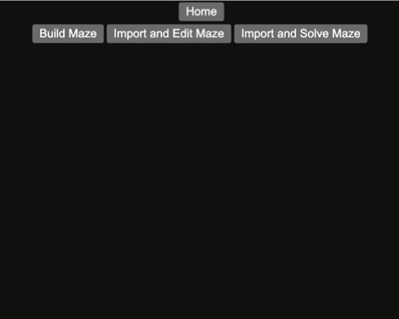

# react-maze

A React project that allows the user to build, edit, and solve mazes using [BFS](https://en.wikipedia.org/wiki/Breadth-first_search).

# Build Maze

# Import and Edit Maze

# Import and Solve Maze

